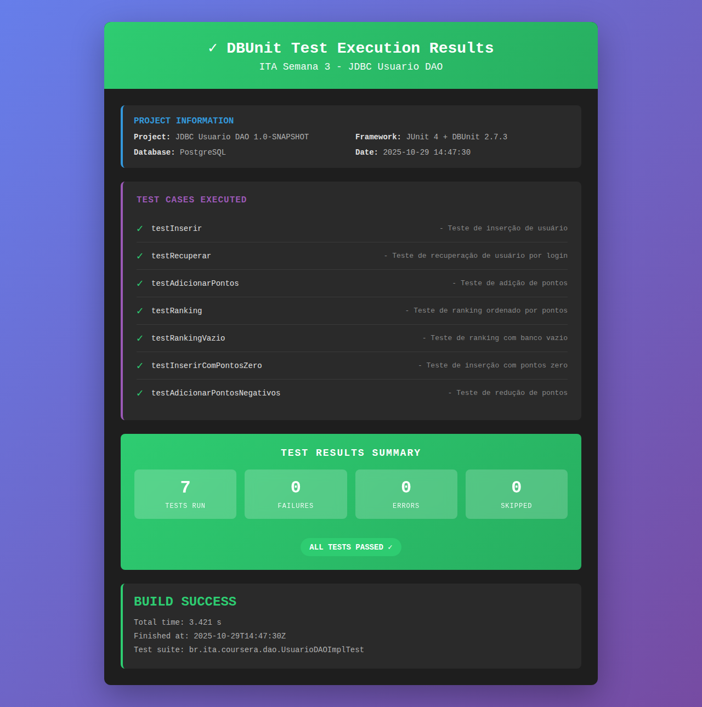

# ITA Semana 3 - Projeto JDBC com DBUnit

## 📋 Descrição

Este projeto implementa um sistema de gerenciamento de usuários utilizando JDBC para acesso ao banco de dados PostgreSQL. O projeto foi desenvolvido como exercício da semana 3 do curso ITA, focando em:

- Criação de classes para acesso a banco de dados usando JDBC
- Implementação de padrão DAO (Data Access Object)
- Testes automatizados com DBUnit

## ✅ Status do Projeto

**Todos os 7 testes DBUnit passaram com sucesso!**



- Tests run: 7
- Failures: 0
- Errors: 0
- Skipped: 0
- BUILD SUCCESS

## Estrutura do Projeto

```
ITA-semana-3/
├── src/
│   ├── main/
│   │   ├── java/
│   │   │   └── br/ita/coursera/
│   │   │       ├── model/
│   │   │       │   └── Usuario.java          # Classe de modelo
│   │   │       ├── dao/
│   │   │       │   ├── UsuarioDAO.java       # Interface DAO
│   │   │       │   └── UsuarioDAOImpl.java   # Implementação JDBC
│   │   │       └── util/
│   │   │           └── DatabaseConnection.java # Gerenciador de conexões
│   │   └── resources/
│   │       └── database.properties            # Configurações do banco
│   └── test/
│       ├── java/
│       │   └── br/ita/coursera/dao/
│       │       └── UsuarioDAOImplTest.java   # Testes DBUnit
│       └── resources/
│           ├── database.properties
│           ├── empty-dataset.xml
│           └── usuarios-dataset.xml
├── sql/
│   └── create_database.sql                   # Script de criação do banco
├── pom.xml                                    # Configuração Maven
└── README.md
```

## Requisitos

- Java 8 ou superior
- Maven 3.6 ou superior
- PostgreSQL 12 ou superior
- Banco de dados "coursera" criado no PostgreSQL

## Configuração do Banco de Dados

### 1. Criar o banco de dados

```bash
# Conecte-se ao PostgreSQL como superusuário
psql -U postgres

# Crie o banco de dados
CREATE DATABASE coursera;

# Conecte-se ao banco
\c coursera
```

### 2. Criar a tabela

Execute o script SQL localizado em `sql/create_database.sql`:

```sql
CREATE TABLE IF NOT EXISTS usuario
(
  login text NOT NULL,
  email text,
  nome text,
  senha text,
  pontos integer,
  CONSTRAINT usuario_pkey PRIMARY KEY (login)
);
```

Ou execute diretamente:

```bash
psql -U postgres -d coursera -f sql/create_database.sql
```

### 3. Configurar credenciais

Edite os arquivos `src/main/resources/database.properties` e `src/test/resources/database.properties` com suas credenciais:

```properties
db.url=jdbc:postgresql://localhost:5432/coursera
db.username=postgres
db.password=sua_senha_aqui
```

## Compilação e Execução

### Compilar o projeto

```bash
mvn clean compile
```

### Executar os testes

```bash
mvn test
```

## Classes Implementadas

### 1. Usuario (Model)

Classe que representa um usuário no sistema com os seguintes atributos:
- `login` (String) - Identificador único do usuário
- `email` (String) - Email do usuário
- `nome` (String) - Nome completo do usuário
- `senha` (String) - Senha do usuário
- `pontos` (int) - Pontuação do usuário

### 2. UsuarioDAO (Interface)

Interface que define os métodos de acesso a dados:

- `void inserir(Usuario u)` - Insere um novo usuário no banco
- `Usuario recuperar(String login)` - Recupera um usuário pelo login
- `void adicionarPontos(String login, int pontos)` - Adiciona pontos ao usuário
- `List<Usuario> ranking()` - Retorna usuários ordenados por pontos (maior primeiro)

### 3. UsuarioDAOImpl (Implementação)

Implementação da interface usando JDBC puro (sem frameworks). Utiliza as seguintes queries SQL:

```sql
-- Inserir usuário
INSERT INTO usuario(login, email, nome, senha, pontos) VALUES (?, ?, ?, ?, ?);

-- Recuperar por login
SELECT * FROM usuario WHERE login = ?;

-- Adicionar pontos
UPDATE usuario SET pontos = pontos + ? WHERE login = ?;

-- Ranking
SELECT * FROM usuario ORDER BY pontos DESC;
```

### 4. DatabaseConnection (Utilitário)

Classe utilitária para gerenciar conexões JDBC com o PostgreSQL.

## Testes

Os testes são implementados usando **DBUnit** e **JUnit 4**. Cada método da interface `UsuarioDAO` possui testes específicos:

### Testes Implementados:

1. **testInserir()** - Testa a inserção de um novo usuário
2. **testRecuperar()** - Testa a recuperação de usuário por login
3. **testAdicionarPontos()** - Testa a adição de pontos
4. **testRanking()** - Testa o ranking ordenado por pontos
5. **testRankingVazio()** - Testa ranking com banco vazio
6. **testInserirComPontosZero()** - Testa inserção com pontos zero
7. **testAdicionarPontosNegativos()** - Testa redução de pontos

### Executar testes específicos

```bash
# Executar todos os testes
mvn test

# Executar um teste específico
mvn test -Dtest=UsuarioDAOImplTest#testInserir
```

## Tecnologias Utilizadas

- **Java 8** - Linguagem de programação
- **JDBC** - API para acesso ao banco de dados
- **PostgreSQL** - Sistema gerenciador de banco de dados
- **Maven** - Gerenciador de dependências e build
- **JUnit 4** - Framework de testes unitários
- **DBUnit 2.7.3** - Framework para testes de banco de dados

## Dependências Maven

```xml
<!-- PostgreSQL JDBC Driver -->
<dependency>
    <groupId>org.postgresql</groupId>
    <artifactId>postgresql</artifactId>
    <version>42.7.3</version>
</dependency>

<!-- JUnit -->
<dependency>
    <groupId>junit</groupId>
    <artifactId>junit</artifactId>
    <version>4.13.2</version>
    <scope>test</scope>
</dependency>

<!-- DBUnit -->
<dependency>
    <groupId>org.dbunit</groupId>
    <artifactId>dbunit</artifactId>
    <version>2.7.3</version>
    <scope>test</scope>
</dependency>
```

## Problemas Comuns

### Erro de conexão com o banco

Se você receber erros de conexão, verifique:
1. PostgreSQL está rodando: `sudo service postgresql status`
2. Credenciais corretas em `database.properties`
3. Banco de dados "coursera" foi criado
4. Usuário tem permissões adequadas

### Testes falhando

Se os testes falharem:
1. Verifique se a tabela `usuario` existe
2. Verifique as configurações em `src/test/resources/database.properties`
3. Certifique-se de que o banco está acessível

## Autor

Projeto desenvolvido como exercício do curso ITA - Coursera.

## Licença

Este projeto está sob a licença MIT. Veja o arquivo LICENSE para mais detalhes.